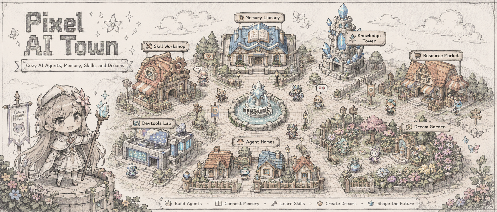

<![CDATA[# Pixel AI Town 🏘️



A living, breathing pixel-art AI agent town — where multiple AI agents reside, work, and interact in a cozy virtual world connected to real infrastructure.

---

## Overview

Pixel AI Town is not a demo or a toy. It is the **visual living layer** for a real multi-agent system. Each agent has its own identity, personality, home, preferred zones, activities, mood, and long-term state. The town connects to real agent infrastructure — AgentMemory, Vipin's Knowledgebase, Agent Hub, Skill Index, and Devtools — to reflect actual system states in real time.

When you open the town, you see AI agents that **live here** — not temporary bots, but long-term residents with memory, skills, knowledge, and relationships.

### Design Philosophy

| Inspiration | What We Take | What We Don't |
|-------------|-------------|---------------|
| **Stardew Valley** | Warmth, livability, explorable zones, resident life | No asset copying, no name copying |
| **Terraria** | Asset pipeline methodology (tileset, sprite sheet, manifest) | No platformer mechanics |
| **AI Agent Systems** | Real long-term state, memory, skills, knowledge | No mock pretending to be real |

---

## Features

### 🏡 Living Town
- **9 Functional Zones** — Town Hall, Memory Library, Skill Workshop, Dream Garden, Devtools Lab, Resource Market, Knowledge Tower, Agent Homes, Central Plaza
- **Rich Map Decorations** — Trees, bushes, pine trees, flowers, rocks, mushrooms, lamps, benches, signs, fences
- **Natural Terrain** — Smooth grass with region-based color blending, warm dirt paths with grass edge transitions
- **Cozy Pixel Art** — All assets generated via GPT Image 2, warm pastel palette, crisp pixels

### 🤖 8 AI Agent Residents + Player Character
| Agent | Role | Home Zone |
|-------|------|-----------|
| **Opus 总舵主** | Chief Architect | Town Hall |
| **像素猫 PixelCat** | Full-Stack Executor | Agent Homes |
| **Codex 协调官** | Coordinator | Agent Homes |
| **Sonnet 审查员** | Code Reviewer | Agent Homes |
| **Haiku 闪电侠** | Speed Runner | Agent Homes |
| **鲸鱼 DeepSeek** | Bulk Worker | Agent Homes |
| **OpenHands 工匠** | Builder | Agent Homes |
| **ARIS 科研框架** | Research Framework | Knowledge Tower |
| **主角 (Player)** | Protagonist | Central Plaza |

Each agent has: personality, mood, activity state, preferred zones, idle animation, click-to-inspect, and data source tracking.

### 📡 Real Data Integration (Read-Only)
| System | What It Reads | Endpoint |
|--------|--------------|----------|
| **AgentMemory** | Memories, types, concepts from `standalone.json` | `/api/town/memory` |
| **Vipin's Knowledgebase** | Decisions, facts, lessons, INDEX.md | `/api/town/memory` |
| **Skill Index** | 411 skills across 19 categories | `/api/town/skills` |
| **Knowledge Wiki** | 1172 pages, recent updates | `/api/town/knowledge` |
| **Devtools** | 20 CLI tools, Agent Hub status | `/api/town/devtools` |
| **Agent Hub** | Real-time agent online/offline status | `/api/health` |

All access is **strictly read-only**. No writes to any real system. Adapter failures gracefully fall back to mock data with clear source labeling.

### 🎮 Interactive Experience
- **Click agents** → Inspector shows identity, status, mood, memory/skill/resource summary
- **Click buildings** → Inspector fetches and displays real data from connected systems
- **Move player** → Click anywhere on the map to move your character
- **Drag to pan** → Hold and drag to explore the map
- **Scroll to zoom** → Smooth tween-animated zoom (0.6x – 3.5x)
- **Debug mode** → Toggle with 🐛 button to show tile grid and zone boundaries
- **Minimize log** → Collapsible event log panel

### 📊 HUD Dashboard
Top bar shows real-time stats:
- Town time / Agent count / Memory count / Skill count / Knowledge entries / Connection status

---

## Tech Stack

| Layer | Technology | Purpose |
|-------|-----------|---------|
| **Game Engine** | Phaser 3.80 | Tile rendering, sprites, camera, input |
| **Frontend** | React 18 + TypeScript 5.5 | UI overlays, panels, state |
| **Build** | Vite 5.4 | Dev server, HMR, production build |
| **Styling** | Tailwind CSS 3.4 + Custom CSS | HUD, panels, pixel-game aesthetic |
| **State** | Zustand 4.5 | Reactive store with adapter/mock tracking |
| **Backend** | FastAPI 0.115 | REST API, WebSocket, tick loop |
| **Database** | SQLite (aiosqlite) | Event persistence |
| **Real-time** | WebSocket | Live state synchronization |
| **Art Pipeline** | GPT Image 2 | All pixel art generation |
| **Image Processing** | Pillow + NumPy | Background removal, resizing |

---

## Quick Start

### One-Click
```bash
cd D:\ai-town
start.cmd          # Starts backend + frontend
# Visit http://localhost:5173
stop.cmd           # Stops everything
```

### Manual
```bash
# Terminal 1: Backend
cd backend
pip install -r requirements.txt
python -m uvicorn main:app --host 0.0.0.0 --port 8000

# Terminal 2: Frontend
cd frontend
npm install
npm run dev
```

Visit **http://localhost:5173**

---

## Project Structure

```
pixel-ai-town/
├── backend/                    — FastAPI server + simulation engine
│   ├── main.py                 — API endpoints, WebSocket, tick loop
│   ├── town_engine.py          — Tick-based agent simulation
│   ├── town_data.py            — Agent & building definitions
│   ├── models.py               — Pydantic models & enums
│   ├── config.py               — Paths, ports, intervals
│   ├── db.py                   — SQLite schema & queries
│   ├── websocket_manager.py    — WebSocket broadcast
│   └── adapters/               — Read-only system integrations
│       ├── agent_hub.py        — Agent Hub HTTP status
│       ├── agentmemory.py      — AgentMemory standalone.json reader
│       ├── shared_memory.py    — Vipin's Knowledgebase memory files
│       ├── skills.py           — SKILL-INDEX.md parser
│       └── knowledge.py        — Wiki page counter & indexer
├── frontend/                   — React + Phaser game client
│   ├── src/
│   │   ├── App.tsx             — Root with error boundary
│   │   ├── main.tsx            — Entry point
│   │   ├── game/
│   │   │   ├── PhaserGame.ts   — Game factory (1280×960, pixelArt mode)
│   │   │   ├── scenes/
│   │   │   │   └── TownScene.ts — Main scene (terrain, paths, decorations, buildings, agents)
│   │   │   └── map/
│   │   │       └── zones.ts    — Zone definitions (40×30 tile map)
│   │   ├── features/pixel-town/ — v2 architecture
│   │   │   ├── PixelTownPage.tsx       — Main page with adapter polling
│   │   │   ├── PixelTownHUD.tsx        — Pixel-game HUD with real data
│   │   │   ├── PixelTownLogPanel.tsx   — Collapsible event log
│   │   │   ├── PixelTownInspector.tsx  — Agent/building detail panel
│   │   │   ├── PixelTownDebugOverlay.tsx — Debug grid & stats
│   │   │   ├── pixelTownStore.ts       — Zustand store (agents, events, config)
│   │   │   ├── pixelTownTypes.ts       — Full type system
│   │   │   ├── pixelTownConstants.ts   — Palette, labels, icons
│   │   │   ├── pixelTownMapData.ts     — 9 structured area entities
│   │   │   ├── pixelTownMockData.ts    — Centralized mock fallback
│   │   │   ├── adapters/
│   │   │   │   └── townDataAdapter.ts  — 9 read-only API adapters
│   │   │   └── styles/
│   │   │       └── pixelTown.css       — Namespaced pixel-game CSS
│   │   ├── hooks/
│   │   │   └── useWebSocket.ts — WebSocket with dual-store sync
│   │   ├── store/
│   │   │   └── townStore.ts    — Legacy Zustand store
│   │   └── ui/                 — Legacy UI components (kept for rollback)
│   └── public/assets/town/     — Production art assets
│       ├── agents/             — 9 transparent-bg agent sprites (128×128)
│       ├── buildings/          — 9 building sprites
│       ├── tileset.png         — Base tileset
│       ├── tileset_terrain.png — Terrain tileset
│       └── tileset_buildings.png — Building tileset
├── frontend/src/assets/pixel-town/ — Asset pipeline
│   ├── README.md               — Asset rules & policies
│   ├── manifest.json           — 22-entry asset registry
│   └── prompts/                — 7 gptimage2 generation prompts
├── art/                        — Art generation pipeline
│   ├── generate.py             — Main batch generator
│   ├── regenerate_sprites.py   — BG removal + deployment
│   ├── prompts.md              — Style guide
│   └── generated/              — Raw generated outputs
├── docs/
│   ├── pixel-ai-town-vision.md      — Product vision document
│   └── pixel-ai-town-art-direction.md — Art & technical spec
├── start.cmd                   — One-click launcher
├── stop.cmd                    — One-click stop
└── banner.png                  — Project banner
```

---

## API Reference

| Method | Path | Description |
|--------|------|-------------|
| `GET` | `/api/health` | System health + adapter status |
| `GET` | `/api/town/state` | Full town state (agents, buildings, events, time) |
| `GET` | `/api/town/agents` | All agent profiles |
| `GET` | `/api/town/agents/{id}` | Single agent detail |
| `GET` | `/api/town/buildings` | All buildings |
| `GET` | `/api/town/events` | Recent events (limit param) |
| `GET` | `/api/town/memory` | AgentMemory + shared memory data |
| `GET` | `/api/town/skills` | Skill index (411 skills, 19 categories) |
| `GET` | `/api/town/knowledge` | Knowledge wiki overview (1172 pages) |
| `GET` | `/api/town/devtools` | Devtools status (20 tools, hub status) |
| `POST` | `/api/town/player/move` | Move player to (x, y) tile |
| `WS` | `/ws` | Real-time state stream (init + tick events) |

---

## Configuration

All paths are configurable via environment variables. Defaults are tuned for the development workstation.

| Variable | Default | Purpose |
|----------|---------|---------|
| `PORT` | `8000` | Backend server port |
| `TICK_INTERVAL` | `5` | Simulation tick interval (seconds) |
| `AGENT_HUB_URL` | `http://127.0.0.1:9800` | Agent Hub status API |
| `AGENTMEMORY_DB` | `~/.agentmemory/data/state_store.db` | AgentMemory data path |
| `SHARED_MEMORY_DIR` | `D:\research\Vipin's Knowledgebase\memory` | Shared memory directory |
| `SKILL_INDEX_PATH` | `D:\agent-resources\SKILL-INDEX.md` | Skill index file |
| `KNOWLEDGE_BASE_DIR` | `D:\research\Vipin's Knowledgebase` | Knowledge base root |
| `VITE_API_PROXY_TARGET` | `http://localhost:8000` | Frontend API proxy |
| `VITE_WS_PROXY_TARGET` | `ws://localhost:8000` | Frontend WebSocket proxy |

---

## Art Pipeline

All visual assets are generated exclusively via **GPT Image 2** (gptimage2). No external assets, no copied game sprites, no network resources.

### Generation
```bash
cd art
python generate.py --all          # Generate all assets
python regenerate_sprites.py      # Regenerate with BG removal
```

### Asset Manifest
Every asset entering the game is registered in `frontend/src/assets/pixel-town/manifest.json` with:
- `id`, `name`, `type`, `file`, `provider` (always gptimage2)
- `copyrightStatus` (always original_generated_asset)
- `sourcePolicy` (always no_external_assets)

### Prompt Engineering
Standardized prompts in `frontend/src/assets/pixel-town/prompts/`:
- `gptimage2-terrain.md` — Grass, dirt, sand, water tiles
- `gptimage2-paths.md` — Cobblestone, dirt path tiles
- `gptimage2-buildings.md` — 9 building sprites
- `gptimage2-props.md` — Trees, flowers, fences, lamps
- `gptimage2-player.md` — Player sprite sheet
- `gptimage2-agents.md` — 8 NPC agent sprites
- `gptimage2-ui.md` — Pixel UI panels, buttons, icons

---

## Safety Boundaries

This project enforces strict safety rules:

| Rule | Enforcement |
|------|-------------|
| No writes to AgentMemory | Backend adapters are read-only |
| No writes to Knowledgebase | Only file reads, no modifications |
| No writes to Skills | Only reads SKILL-INDEX.md |
| No writes to Devtools | Only lists .cmd files |
| No destructive migrations | No schema changes to external DBs |
| No mock pretending to be real | Source badge shows adapter/mock/unavailable |
| Adapter failure = graceful fallback | Page never crashes on data unavailability |
| No external art assets | gptimage2 is the only generation path |

---

## Development

### Type Check
```bash
cd frontend
npx tsc --noEmit
```

### Production Build
```bash
cd frontend
npx vite build
```

### Regenerate Sprites (with background removal)
```bash
cd art
python regenerate_sprites.py --agents
```

### Debug Mode
Click the 🐛 button (bottom-right) to toggle:
- Tile grid overlay
- Zone boundary lines
- Adapter source info
- FPS / render stats

---

## Rollback

To revert to the pre-v2 UI:
1. In `App.tsx`, replace `<PixelTownPage />` with the original layout
2. The legacy components remain in `src/ui/` (TownHeader, EventFeed, AgentPanel, BuildingPanel)
3. Remove `features/pixel-town/` import

---

## License

MIT
]]>